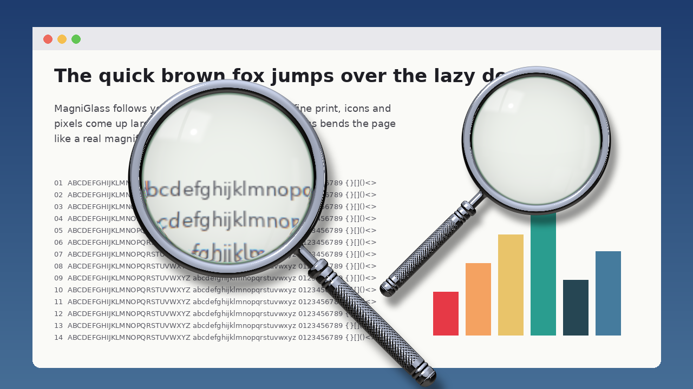
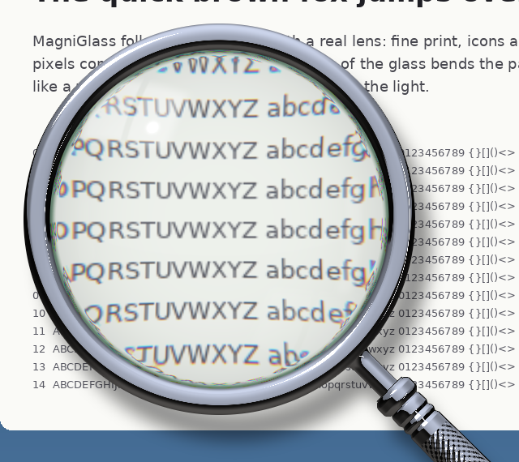
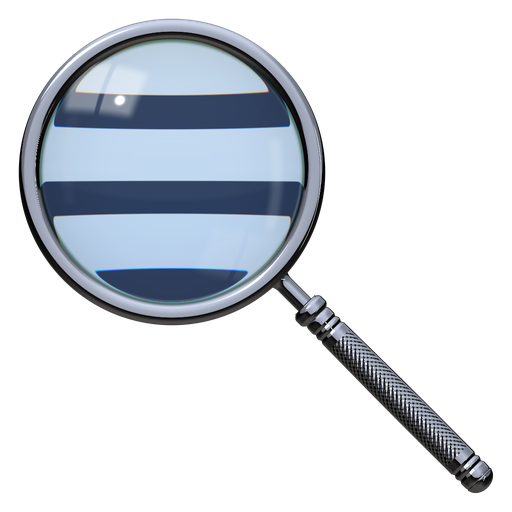

# MagniGlass: a real magnifying glass for your screen

[](https://github.com/vagdesign/MagniGlass/actions/workflows/build.yml) [](https://github.com/vagdesign/MagniGlass/releases/latest)

MagniGlass puts a **realistic hand magnifier** on your screen that follows the mouse pointer, for **Windows** and **macOS**. Press a shortcut and the glass appears; press it again and it goes away. While the glass is shown, the **mouse wheel zooms** in and out.



The glass is drawn with simple optics instead of a flat zoomed square:

- **Real lens refraction**: the area under the pointer magnified, with the slight pincushion distortion of a real convex lens growing towards the rim, and a strongly bent, darker band at the **ground edge of the glass**
- **Colour fringes** at the edge (blue bends more than red), like a real simple lens
- **Reflections** of a studio window and a strip light on the curved front surface, a fainter mirrored one from the back surface, a small sparkle and Fresnel sheen towards the rim
- **Chrome body**: a polished chrome rim, a ferrule and neck, a collar, a **knurled chrome grip** with turned grooves and a domed end cap, all shaded as mirrors of the same studio
- A soft **drop shadow**: dark under the metal, faint under the glass, so the magnifier seems to float above the screen

| Close-up | Icon |
|---|---|
|  |  |

## Settings

| Setting | |
|---|---|
| **Shortcut** | Any key combination (click the box and press it). Default **Ctrl + Alt + M** on Windows, **⌃⌥M** on Mac |
| **Glass size** | In **pixels** (points on Mac, at 100 % display scaling) or as a **% of the screen** (of its shorter side) |
| **Magnification** | Slider, 1× to 10× (default 2.5×). The **mouse wheel** changes it too while the glass is shown; the last zoom is remembered |
| **Wheel** | On / off, an optional key to hold (Ctrl, Shift, Alt / ⌃ ⌥ ⇧ ⌘) so the wheel still scrolls pages normally, and the zoom step per notch |
| **Handle** | Grip to the lower right or lower left (left-handed), drop shadow on / off |
| **Start at sign-in** | Start MagniGlass with Windows / open at login on Mac |

The settings window shows a **live preview** of the glass with your choices.

## Install

### Windows 10 / 11

1. Download `MagniGlass-Setup-x.y.z.exe` from the [latest release](https://github.com/vagdesign/MagniGlass/releases/latest) (or from the **Actions** tab → latest *MagniGlass* run → artifacts).
2. Run it. No administrator rights are needed. SmartScreen may warn because the installer is not code-signed: *More info → Run anyway*.
3. MagniGlass starts in the notification area (near the clock). Press **Ctrl + Alt + M**. Right-click the tray icon for **Settings** and **Exit**; left-click it to show / hide the glass.

Portable: unzip `MagniGlass-portable-…zip` anywhere and run `MagniGlass.exe`.

### macOS 12.3+

1. Download `MagniGlass-mac-x.y.z.zip` from the [latest release](https://github.com/vagdesign/MagniGlass/releases/latest), unzip it and move **MagniGlass.app** to Applications, then open it. If the build is not notarized, right-click → **Open** the first time.
2. Allow **Screen Recording** when macOS asks (System Settings › Privacy & Security › Screen & System Audio Recording), then quit and reopen MagniGlass. It needs this to see what is under the pointer; nothing is saved or sent anywhere.
3. Optional: allow **Accessibility** so the scroll wheel zooms *without* also scrolling the page under the glass. Without it the wheel still zooms, but the page scrolls too (or set a key to hold in Settings).
4. MagniGlass lives in the menu bar (magnifier icon): **Show Magnifier**, **Settings…**, **Quit**. Press **⌃⌥M** anywhere.

## How it works

```
core/lenscore.c      the lens renderer, shared by both apps (plain C, no dependencies)
win/MagniGlass/      Windows app (C# / WinForms, .NET 8): tray icon, shortcut, wheel hook, settings
mac/MagniGlass.m     macOS app (Objective-C): menu bar, shortcut, wheel tap, settings
installer/           Inno Setup script for the Windows installer
test/preview.c       renders the glass over a picture, to check the look on any machine
tools/make-icons.sh  renders the app icons with the lens renderer itself
```

- The **renderer** draws everything that never changes (shadow, chrome rim and grip) once per size. Each frame it only applies a refraction table to the screen pixels around the pointer: per colour channel, bilinear, with the reflections screen-blended on top. A 320 px glass takes well under a millisecond per frame; big glasses are split across cores.
- **Windows**: the glass is a click-through, per-pixel-alpha layered window on its own thread, paced by the compositor (one frame per screen refresh). It is excluded from screen capture (`WDA_EXCLUDEFROMCAPTURE`, Windows 10 2004+), so it never magnifies itself; this also means the glass does not appear in screenshots. The shortcut uses `RegisterHotKey`; the wheel uses a low-level mouse hook that is only installed while the glass is shown. Per-monitor DPI aware.
- **macOS**: the screen comes from ScreenCaptureKit with MagniGlass itself excluded; the glass is a borderless, click-through window above everything, updated at the display rate. The shortcut uses Carbon `RegisterEventHotKey`; the wheel uses an event tap (or a passive monitor without Accessibility permission).

## Build

- **Lens preview anywhere** (Linux / Mac / Windows with a C compiler):
  `cc -O2 -o preview test/preview.c core/lenscore.c -lm && ./preview screen.ppm out.ppm 320 2.5 400 300`
  (`python3 test/make-screen.py screen.ppm` makes a sample screen.)
- **Windows**: `dotnet publish win/MagniGlass/MagniGlass.csproj -c Release -r win-x64 --self-contained true -o publish` (needs the .NET 8 SDK and `clang-cl`, which ships with Visual Studio's C++ Clang tools or LLVM; it builds `lenscore.dll`). Then `ISCC installer\MagniGlass.iss` for the installer.
- **macOS**: `mac/build.sh 1.0.0` → `out/MagniGlass.app` (universal, needs the Xcode command line tools).
- **CI**: `.github/workflows/build.yml` builds the lens previews, the Windows installer + portable zip and the Mac app (signed and notarized when the Developer ID secrets are set). Every push to `main` publishes the release `v<VERSION>` (the `VERSION` at the top of the workflow); bump it for a new version.

## License

GPL-3.0 (see [LICENSE](LICENSE)). © 2026 Ax-Easy – Vangelis Makridakis. Built with Claude (Anthropic).
